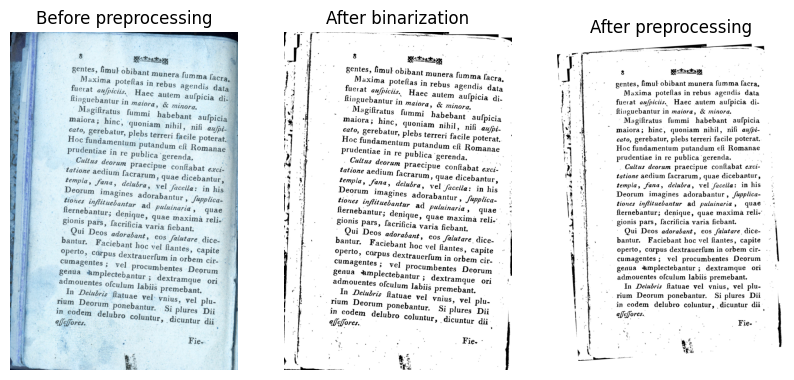

# dedoc-utils

This library contains useful utilities for automatic document images processing:

1. Preprocessing
    * binarization
    * skew correction
2. Text detection
3. Line segmentation
4. Text recognition

## Installation

The library requires Tesseract OCR to be installed.
To install the library use the following command:

```bash
pip install dedoc-utils
```

It's supposed that you already have `torch` and `torchvision` installed.
If not you can use the following command for installation:

```bash
pip install "dedoc-utils[torch]"
```

If you cloned the repository, you can install the dependencies via `pip`:

```bash
pip install .
```

To install `torch` packages use:
```bash
pip install ."[torch]"
```

## Basic usage

### Using preprocessors

```python
from dedocutils.preprocessing import AdaptiveBinarizer, SkewCorrector
import cv2
import matplotlib.pyplot as plt

binarizer = AdaptiveBinarizer()
skew_corrector = SkewCorrector()

image = cv2.imread("examples/before_preprocessing.jpg")
binarized_image = binarizer.preprocess(image)
preprocessed_image = skew_corrector.preprocess(binarized_image)

fig = plt.figure(figsize=(10, 7))
rows, columns = 1, 3

fig.add_subplot(rows, columns, 1)
plt.imshow(image)
plt.axis('off')
plt.title("Before preprocessing")
  
fig.add_subplot(rows, columns, 2)
plt.imshow(binarized_image)
plt.axis('off')
plt.title("After binarization")

fig.add_subplot(rows, columns, 3)
plt.imshow(preprocessed_image)
plt.axis('off')
plt.title("After preprocessing")
```



### Using text detectors

```python
from dedocutils.text_detection import DoctrTextDetector

text_detector = DoctrTextDetector()
bboxes = text_detector.detect(preprocessed_image)

for bbox in bboxes[:5]:
    print(bbox)
```

> BBox(x_top_left=2415, y_top_left=3730, width=202, height=97)  
BBox(x_top_left=790, y_top_left=3613, width=383, height=105)  
BBox(x_top_left=1690, y_top_left=3488, width=407, height=104)  
BBox(x_top_left=2171, y_top_left=3488, width=377, height=92)  
BBox(x_top_left=885, y_top_left=3505, width=27, height=50)  

### Using text recognizers

```python
from dedocutils.text_recognition import TesseractTextRecognizer

text_recognizer = TesseractTextRecognizer()

for bbox in bboxes[:10]:
    word_image = preprocessed_image[bbox.y_top_left:bbox.y_bottom_right, bbox.x_top_left:bbox.x_bottom_right]
    text = text_recognizer.recognize(word_image, parameters=dict(language="eng"))
    print(text)
```

> Fie-  
afjefjores.  
coluntur,  
dicuntur  
delubro  
eodem  
dii
in  
plures

### Using line segmenters

In the previous example, the order of the recognized words isn't the same 
as the order of the words in the document.
It happens because of undetermined work of the text detector.
In this case, one may use line segmenter to sort bboxes from the text detector.

```python
from dedocutils.line_segmentation import ClusteringLineSegmenter

line_segmenter = ClusteringLineSegmenter()
sorted_bboxes = line_segmenter.segment(bboxes)
for bbox in sorted_bboxes[1]:
    word_image = preprocessed_image[bbox.y_top_left:bbox.y_bottom_right, bbox.x_top_left:bbox.x_bottom_right]
    text = text_recognizer.recognize(word_image, parameters=dict(language="eng"))
    print(text)
```

> gentes,  
fimul.  
obibant  
munera  
fumma  
facra,  
